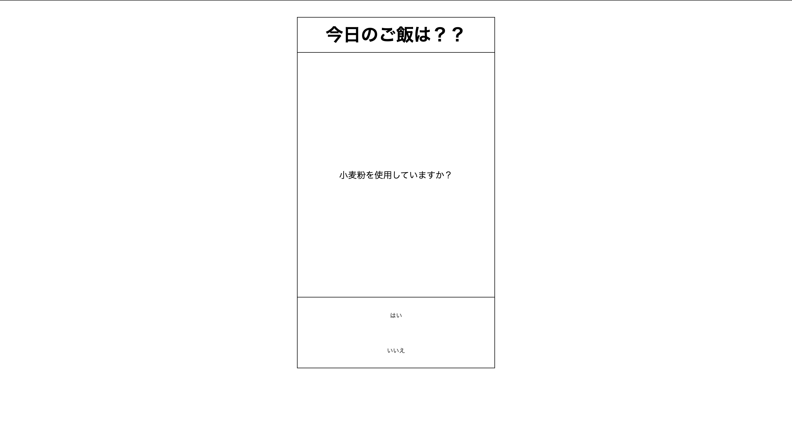

# アキネイタージェネレーター

[](https://youtu.be/i4qPoudgto0)
[Youtubeリンク](https://youtu.be/i4qPoudgto0)

## 製品概要
### 意志決定 X Tech

### 背景（製品開発のきっかけ、課題等）
**自分だけのアキネイターが欲しい！**
- 世界には様々な情報が溢れています。その膨大なデータの中からジャンルに特化したアキネイターを作成し、自分だけのアキネイターを用いて意思決定したいことから今回のプロダクトを開発したいと思いました.


### 製品説明（具体的な製品の説明）
- 食べたい食品をいくつかの質問から決定してくれます.

### 特長

#### 1. 読み込んだデータをもとにJinnが質問をしてくれる.

#### 2. 質問に対して、はい/いいえで答えることができる.

#### 3. 回答から食べたい食品を決定してくれる.

### 解決出来ること
食べたいものが決まらず、困っているあなたを助けてくれます.

- 普段の会話の例
```
Aさん：「晩御飯は何がいい-?」
Bさん：「なんでもいいよ〜」
Aさん：「は?」
Bさん：「」
```
今回のプロダクトを使うとこのような殺伐とした雰囲気になりません.


### 今後の展望
まだ、様々なデータに対応していないので、今後の開発で改善していく. 

## 開発内容・開発技術
### 活用した技術
#### API・データ
今回スポンサーから提供されたAPI、製品などの外部技術があれば記述をして下さい.

* 
* 
* 

#### フレームワーク・ライブラリ・モジュール
* Flask
* Python 

#### デバイス
* MacBookPro
* 

### 研究内容・事前開発プロダクト（任意）
ご自身やチームの研究内容や、事前に持ち込みをしたプロダクトがある場合は、こちらに実績なども含め記載をして下さい。

* 
* 


### 独自開発技術（Hack Dayで開発したもの）
#### 2日間に開発した独自の機能・技術
* ユーザーが持っているデータに特化した意思決定ができる.
